Greenhouse Gas Emissions by the Three Most Populous Countries
================
Morgan Hagood

## Introduction

**For this project, I wanted to observe greenhouse gas emissions by the
top most populous countries in the world. My data was retrieved from Our
World in Data and The World Bank. One dataset was population data by
country and the other was greenhouse gas emissions by country. The
greenhouse gas data contained many other variables about the source of
the carbon dioxide emissions and growth percentages of emissions, etc.,
but I chose to focus on the total carbon dioxide emissions, total
methane emissions, total nitrous oxide emissions, year, and country
names. The population data contained country name variabes, country
codes, and the population of each country by year. I was interested in
seeing if there was a relationship between an increase in population and
greenhouse gas emissions. I suspected that there would also be
relationships between population and emissions by year. However,
conclusions cannot be made from any relationships due to the different
regulatory government policies in place in each country, which may
influence results.**

## References:

*Mathieu, H. R. M. R. (2021). Data on CO2 and Greenhouse Gas Emissions
by Our World in Data \[Data set\]. Retrieved from
<https://github.com/owid/co2-data> (Original work published 2020)*

*The World Bank. ( 1 ) United Nations Population Division. World
Population Prospects: 2019 Revision. ( 2 ) Census reports and other
statistical publications from national statistical offices, ( 3 )
Eurostat: Demographic Statistics, ( 4 ) United Nations Statistical
Division. Population and Vital Statistics Reprot ( various years ), ( 5
) U.S. Census Bureau: International Database, and ( 6 ) Secretariat of
the Pacific Community: Statistics and Demography Programme. (2019).
Population, total \[Data set\]. Retrieved from
<https://data.worldbank.org/indicator/SP.POP.TOTL>*

## Load packages and Import Datasets

**The datasets were excel files from Our World in Data and The World
Bank.**

``` r
# Load necessary packages
library(tidyverse)
```

    ## ── Attaching packages ─────────────────────────────────────── tidyverse 1.3.1 ──

    ## ✓ ggplot2 3.3.3     ✓ purrr   0.3.4
    ## ✓ tibble  3.1.1     ✓ dplyr   1.0.5
    ## ✓ tidyr   1.1.3     ✓ stringr 1.4.0
    ## ✓ readr   1.4.0     ✓ forcats 0.5.1

    ## ── Conflicts ────────────────────────────────────────── tidyverse_conflicts() ──
    ## x dplyr::filter() masks stats::filter()
    ## x dplyr::lag()    masks stats::lag()

``` r
library(ggplot2)
library(dplyr)
library(readxl)
library(RColorBrewer)
library(factoextra)
```

    ## Welcome! Want to learn more? See two factoextra-related books at https://goo.gl/ve3WBa

``` r
# I found datasets of the world population and greenhouse gas emissions by every country in the world
# Import datasets and set as working directory
pop_data <-  read_excel("~/Downloads/API_SP.POP.TOTL_DS2_en_excel_v2_2106205.xls")
CO2_data <- read_excel("~/Downloads/owid-co2-data.xlsx")
# View the data using head()
head(pop_data)
```

    ## # A tibble: 6 x 65
    ##   `Country Name` `Country Code` `Indicator Name`  `Indicator Code` `1960` `1961`
    ##   <chr>          <chr>          <chr>             <chr>             <dbl>  <dbl>
    ## 1 Aruba          ABW            Population, total SP.POP.TOTL      5.42e4 5.54e4
    ## 2 Afghanistan    AFG            Population, total SP.POP.TOTL      9.00e6 9.17e6
    ## 3 Angola         AGO            Population, total SP.POP.TOTL      5.45e6 5.53e6
    ## 4 Albania        ALB            Population, total SP.POP.TOTL      1.61e6 1.66e6
    ## 5 Andorra        AND            Population, total SP.POP.TOTL      1.34e4 1.44e4
    ## 6 Arab World     ARB            Population, total SP.POP.TOTL      9.22e7 9.47e7
    ## # … with 59 more variables: 1962 <dbl>, 1963 <dbl>, 1964 <dbl>, 1965 <dbl>,
    ## #   1966 <dbl>, 1967 <dbl>, 1968 <dbl>, 1969 <dbl>, 1970 <dbl>, 1971 <dbl>,
    ## #   1972 <dbl>, 1973 <dbl>, 1974 <dbl>, 1975 <dbl>, 1976 <dbl>, 1977 <dbl>,
    ## #   1978 <dbl>, 1979 <dbl>, 1980 <dbl>, 1981 <dbl>, 1982 <dbl>, 1983 <dbl>,
    ## #   1984 <dbl>, 1985 <dbl>, 1986 <dbl>, 1987 <dbl>, 1988 <dbl>, 1989 <dbl>,
    ## #   1990 <dbl>, 1991 <dbl>, 1992 <dbl>, 1993 <dbl>, 1994 <dbl>, 1995 <dbl>,
    ## #   1996 <dbl>, 1997 <dbl>, 1998 <dbl>, 1999 <dbl>, 2000 <dbl>, 2001 <dbl>,
    ## #   2002 <dbl>, 2003 <dbl>, 2004 <dbl>, 2005 <dbl>, 2006 <dbl>, 2007 <dbl>,
    ## #   2008 <dbl>, 2009 <dbl>, 2010 <dbl>, 2011 <dbl>, 2012 <dbl>, 2013 <dbl>,
    ## #   2014 <dbl>, 2015 <dbl>, 2016 <dbl>, 2017 <dbl>, 2018 <dbl>, 2019 <dbl>,
    ## #   2020 <lgl>

``` r
head(CO2_data)
```

    ## # A tibble: 6 x 55
    ##   iso_code country     year   co2 co2_growth_prct co2_growth_abs consumption_co2
    ##   <chr>    <chr>      <dbl> <dbl>           <dbl>          <dbl>           <dbl>
    ## 1 AFG      Afghanist…  1949 0.015           NA            NA                  NA
    ## 2 AFG      Afghanist…  1950 0.084          475             0.07               NA
    ## 3 AFG      Afghanist…  1951 0.092            8.70          0.007              NA
    ## 4 AFG      Afghanist…  1952 0.092           NA            NA                  NA
    ## 5 AFG      Afghanist…  1953 0.106           16             0.015              NA
    ## 6 AFG      Afghanist…  1954 0.106           NA            NA                  NA
    ## # … with 48 more variables: trade_co2 <dbl>, trade_co2_share <dbl>,
    ## #   co2_per_capita <dbl>, consumption_co2_per_capita <dbl>,
    ## #   share_global_co2 <dbl>, cumulative_co2 <dbl>,
    ## #   share_global_cumulative_co2 <dbl>, co2_per_gdp <dbl>,
    ## #   consumption_co2_per_gdp <dbl>, co2_per_unit_energy <dbl>, cement_co2 <dbl>,
    ## #   coal_co2 <dbl>, flaring_co2 <dbl>, gas_co2 <dbl>, oil_co2 <dbl>,
    ## #   other_industry_co2 <lgl>, cement_co2_per_capita <dbl>,
    ## #   coal_co2_per_capita <dbl>, flaring_co2_per_capita <dbl>,
    ## #   gas_co2_per_capita <dbl>, oil_co2_per_capita <dbl>,
    ## #   other_co2_per_capita <lgl>, share_global_coal_co2 <dbl>,
    ## #   share_global_oil_co2 <dbl>, share_global_gas_co2 <dbl>,
    ## #   share_global_flaring_co2 <dbl>, share_global_cement_co2 <dbl>,
    ## #   cumulative_coal_co2 <dbl>, cumulative_oil_co2 <dbl>,
    ## #   cumulative_gas_co2 <dbl>, cumulative_flaring_co2 <dbl>,
    ## #   cumulative_cement_co2 <dbl>, share_global_cumulative_coal_co2 <dbl>,
    ## #   share_global_cumulative_oil_co2 <dbl>,
    ## #   share_global_cumulative_gas_co2 <dbl>,
    ## #   share_global_cumulative_flaring_co2 <dbl>,
    ## #   share_global_cumulative_cement_co2 <dbl>, total_ghg <dbl>,
    ## #   ghg_per_capita <dbl>, methane <dbl>, methane_per_capita <dbl>,
    ## #   nitrous_oxide <dbl>, nitrous_oxide_per_capita <dbl>,
    ## #   primary_energy_consumption <dbl>, energy_per_capita <dbl>,
    ## #   energy_per_gdp <dbl>, population <dbl>, gdp <dbl>

## Tidy Data and Merge

**The population dataset and greenhouse gas dataset were merged using
left\_join by their similar variables of country name, year, and country
code. The populations were not merged because the population varibale in
the greenhouse gas data was not exact, so it was removed from the merged
dataset. The variables Country Name, year, population, CO2, methane, and
nitrous gas were selected to obserce. The top three most populous
countries were filtered to study in order to observe the relationships
between population and greenhouse gas emissions. The countries were
China, India, and the United States.**

``` r
# Tidy the population data set by using pivot_longer() to make a variable 'year' with its observations
pop_data1 <- pop_data %>% pivot_longer(cols = c(`1960` : `2020`), names_to = "year", values_to = "population") %>% mutate(year = as.numeric(year))

# Join the datasets by country using left_merge()
CO2_by_country <- left_join(pop_data1, CO2_data, by = c('Country Name'= 'country', 'year' = 'year', 'Country Code' = 'iso_code'), copy = T) 

# Select necessary variables and save as a new dataset
CO2_by_country_clean <- CO2_by_country %>% select('Country Name', 'year', 'population.x', 'co2', 'methane', 'nitrous_oxide') %>% rename(population = "population.x") 

# I wanted to observe the 3 most populous countries, so I filtered them by the most recent population data
# Filter by the most recent year and arrange by descending population to find the top 3 most populous countries to observe
CO2_by_country_clean %>% filter(year == '2019') %>% arrange(desc(population))
```

    ## # A tibble: 264 x 6
    ##    `Country Name`              year population   co2 methane nitrous_oxide
    ##    <chr>                      <dbl>      <dbl> <dbl>   <dbl>         <dbl>
    ##  1 World                       2019 7673533974    NA      NA            NA
    ##  2 IDA & IBRD total            2019 6486934853    NA      NA            NA
    ##  3 Low & middle income         2019 6437681136    NA      NA            NA
    ##  4 Middle income               2019 5769226171    NA      NA            NA
    ##  5 IBRD only                   2019 4816235953    NA      NA            NA
    ##  6 Early-demographic dividend  2019 3290290613    NA      NA            NA
    ##  7 Lower middle income         2019 2913363391    NA      NA            NA
    ##  8 Upper middle income         2019 2855862780    NA      NA            NA
    ##  9 East Asia & Pacific         2019 2340628292    NA      NA            NA
    ## 10 Late-demographic dividend   2019 2298470832    NA      NA            NA
    ## # … with 254 more rows

``` r
# Save the dataset with the top 3 most populous countries
CO2_top3 <- CO2_by_country_clean %>% filter(`Country Name`== c('China','India','United States')) 
```

## Summary Statistics

#### The summary statistics for population and each greenhouse gas were observed per country. The summary statistics included mean, median, standard deviation, variance, minimum, maximum, distinct number, 25% quantile, 75% quantile, corrrelation between population and CO2, and the correlation between the year and CO2/methane/nitrous oxide.

``` r
# Find the summary statistics of each dependent variable (population, co2, methane, and nitrous oxide)

# Group by Country Name
pop_stats <-CO2_top3 %>% group_by(`Country Name`) %>% summarize(mean(population), median(population),sd(population),var(population),min(population),max(population),n_distinct(population),quantile(population,0.25),quantile(population,0.75),cor(population, co2)) %>% as.data.frame
print.data.frame(pop_stats)
```

    ##    Country Name mean(population) median(population) sd(population)
    ## 1         China       1087757000         1126205000      236690767
    ## 2         India        896054315          882320847      294647149
    ## 3 United States        256270884          251666500       45663759
    ##   var(population) min(population) max(population) n_distinct(population)
    ## 1    5.602252e+16       660330000      1392730000                     20
    ## 2    8.681694e+16       469077190      1366417754                     20
    ## 3    2.085179e+15       186538000       328239523                     20
    ##   quantile(population, 0.25) quantile(population, 0.75) cor(population, co2)
    ## 1                  918498750                 1294055000            0.8537447
    ## 2                  641507232                 1143019960            0.9348837
    ## 3                  218642750                  294911775            0.8467007

``` r
# Group by Country Name
co2_stats <- CO2_top3 %>% group_by(`Country Name`) %>% 
  # Find the summary statistics of carbon dioxide
  summarize(mean(co2), median(co2),sd(co2),var(co2),min(co2),max(co2),n_distinct(co2),quantile(co2,0.25),quantile(co2,0.75),cor(year, co2)) %>% as.data.frame
print.data.frame(co2_stats)
```

    ##    Country Name mean(co2) median(co2)   sd(co2)   var(co2) min(co2) max(co2)
    ## 1         China 3593.8719   2442.8965 3277.4577 10741728.9  432.224 9956.569
    ## 2         India  861.7187    598.7575  776.4743   602912.3  132.776 2616.449
    ## 3 United States 4933.3422   5065.3640  870.8125   758314.4 2984.002 6128.430
    ##   n_distinct(co2) quantile(co2, 0.25) quantile(co2, 0.75) cor(year, co2)
    ## 1              20            1134.635            4933.669      0.9219465
    ## 2              20             248.504            1183.427      0.9249311
    ## 3              20            4453.719            5560.036      0.8508328

``` r
# Group by Country Name
methane_stats <- CO2_top3 %>% group_by(`Country Name`) %>% 
  # Remove NAs
  na.omit() %>% 
  # Find summary statistics of methane
  summarize(mean(methane), median(methane),sd(methane),var(methane),min(methane),max(methane),n_distinct(methane),quantile(methane,0.25),quantile(methane,0.75),cor(year, methane)) %>% as.data.frame 
print.data.frame(methane_stats)
```

    ##    Country Name mean(methane) median(methane) sd(methane) var(methane)
    ## 1         China      922.2544          830.67   184.76223    34137.081
    ## 2         India      612.9744          612.75    47.99172     2303.205
    ## 3 United States      705.1278          695.48    55.90339     3125.189
    ##   min(methane) max(methane) n_distinct(methane) quantile(methane, 0.25)
    ## 1       745.19      1258.21                   9                  792.61
    ## 2       538.98       663.63                   9                  578.39
    ## 3       629.38       800.73                   9                  679.25
    ##   quantile(methane, 0.75) cor(year, methane)
    ## 1                 1026.00          0.9252415
    ## 2                  660.15          0.9747816
    ## 3                  717.39         -0.9389427

``` r
# Group by Country Name
nox_stats <- CO2_top3 %>% group_by(`Country Name`) %>% 
  # Remove NAs
  na.omit()  %>% 
  # Find summary statistics of nitrous oxide
  summarize(mean(nitrous_oxide), median(nitrous_oxide),sd(nitrous_oxide),var(nitrous_oxide),min(nitrous_oxide),max(nitrous_oxide),n_distinct(nitrous_oxide),quantile(nitrous_oxide,0.25),quantile(nitrous_oxide,0.75),cor(year, nitrous_oxide)) %>% as.data.frame
print.data.frame(nox_stats)
```

    ##    Country Name mean(nitrous_oxide) median(nitrous_oxide) sd(nitrous_oxide)
    ## 1         China            421.3689                410.20          81.16260
    ## 2         India            203.1956                195.16          36.76279
    ## 3 United States            262.6444                261.95          10.51959
    ##   var(nitrous_oxide) min(nitrous_oxide) max(nitrous_oxide)
    ## 1          6587.3676             318.54             552.98
    ## 2          1351.5025             149.92             247.43
    ## 3           110.6618             250.84             278.99
    ##   n_distinct(nitrous_oxide) quantile(nitrous_oxide, 0.25)
    ## 1                         9                        367.43
    ## 2                         9                        179.25
    ## 3                         9                        251.70
    ##   quantile(nitrous_oxide, 0.75) cor(year, nitrous_oxide)
    ## 1                        478.86                0.9928840
    ## 2                        241.06                0.9843161
    ## 3                        272.74               -0.6685390

## Correlation Matrix Heatmap

**The correlation matrix heatmap was constructed using the countries
China and India only. This is because the population of the United
States is much less than those of China and India, which skews the
correlation data by population. Therefore, it was removed for this
observation. It can be seen in the heatmap that there are strong
correlations between the different greenhouse gases, and high
correlations with year and population.**

``` r
# The US was not included in the correlation matrix because its population is much lower, so China and India were observed

# Filter by China and India and save as a data frame
country.data.cor <- CO2_top3 %>% filter(`Country Name` == c('China','India')) %>% as.data.frame

# Build a correlation matrix between all numeric variables
country_cor_num <- country.data.cor %>% select_if(is.numeric) 
cor(country_cor_num, use = "pairwise.complete.obs")
```

    ##                    year population       co2   methane nitrous_oxide
    ## year          1.0000000  0.9136914 0.6389112 0.5352175     0.4283001
    ## population    0.9136914  1.0000000 0.7289489 0.7986483     0.8428672
    ## co2           0.6389112  0.7289489 1.0000000 0.9896335     0.9634225
    ## methane       0.5352175  0.7986483 0.9896335 1.0000000     0.9632900
    ## nitrous_oxide 0.4283001  0.8428672 0.9634225 0.9632900     1.0000000

``` r
# Make a correlation matrix heatmap
cor(country_cor_num, use = "pairwise.complete.obs") %>%
  # Save as a data frame
  as.data.frame %>%
  # Convert row names to variable
  rownames_to_column %>%
  # Pivot so that all correlations appear in the same column
  pivot_longer(-1, names_to = "other_var", values_to = "correlation") %>%
  ggplot(aes(rowname, other_var, fill=correlation)) +
  # Heatmap with geom_tile
  geom_tile() +
  # Change the scale to make the middle appear neutral
  scale_fill_gradient2(low="#FC4E07",mid="white",high="#00AFBB") + 
  # Overlay values
  geom_text(aes(label = round(correlation,2)), color = "black", size = 4) +
  # Give title and labels
  labs(title = "Correlation matrix Heatmap for China and India", x = "variable 1", y = "variable 2")
```

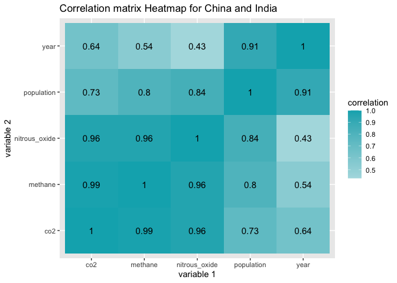<!-- -->

## Concentration Heatmap

**In order to visualize all the variables togehter, a concentration
heatmap was constructed. Therefore, the greater the number, the more
concentrated the color is in the heatmap. For each country, each
variable is shown acorrding to the year. It can be seen that throughout
the years, population increases for each country, along with each
greenhouse gas. However, it is shown that methane and nitrous oxide
decrease in the United States. Methane and Nitrous Oxide do not have
measurements until the most recent decade because it was not regulated
in years prior.**

``` r
# Save color palette as a vector
color <- colorRampPalette(brewer.pal(9,'Blues'))(100)

# Make a vector for China
CO2_China <- CO2_top3 %>% 
  #Filter China from Country Name
  filter(`Country Name`=='China') %>% 
  #Mutate variables to numeric
  mutate_all(as.numeric) %>% 
  #Remove Country Name and year variables
  select(-'Country Name',-'year') %>% 
  # Save as a matrix
  as.matrix 
```

    ## Warning in mask$eval_all_mutate(quo): NAs introduced by coercion

``` r
# Label rows to correlating years
row.names(CO2_China) <- c('1961','1964','1967','1970','1973','1976','1979','1982','1985','1988','1991','1994','1997','2000','2003','2006','2009','2012','2015','2018')

# Create a concentration heatmap
heatmap(CO2_China,scale = 'column',Colv = NA, Rowv = NA, xlab = 'Country Variables',ylab = 'Year', col = color,cexRow = 0.8, cexCol = 0.75, main = 'Heatmap of China Variables by Year')
```

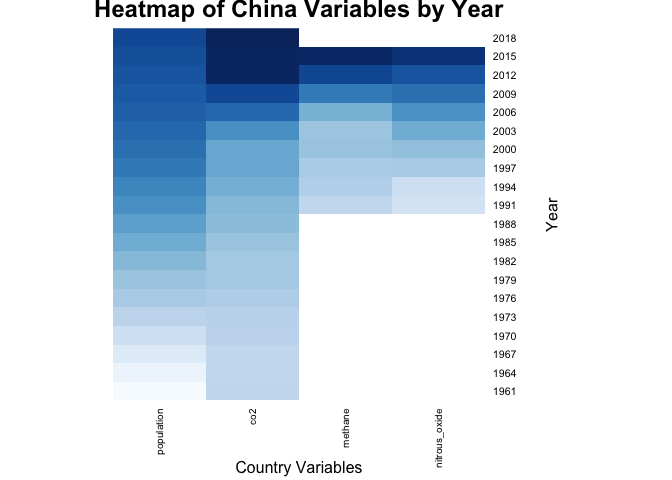<!-- -->

``` r
# Make a vector for India
CO2_India <- CO2_top3 %>% 
  # Filter India from Country Name
  filter(`Country Name`=='India') %>% 
  #Mutate variables to numeric 
  mutate_all(as.numeric) %>% 
  #Remove Country Name and year variables
  select(-'Country Name',-'year') %>% 
  #Save as a matrix
  as.matrix
```

    ## Warning in mask$eval_all_mutate(quo): NAs introduced by coercion

``` r
# Label rows to correlating years
row.names(CO2_India) <- c('1962','1965','1968','1971','1974','1977','1980','1983','1986','1989','1992','1995','1998','2001','2004','2007','2010','2013','2016','2019')

# Create a heatmap
heatmap(CO2_India,scale = 'column',Colv = NA, Rowv = NA, xlab = 'Country Variables',ylab = 'Year',col = color,cexRow = 0.8, cexCol = 0.75,main = 'Heatmap of India Variables by Year') 
```

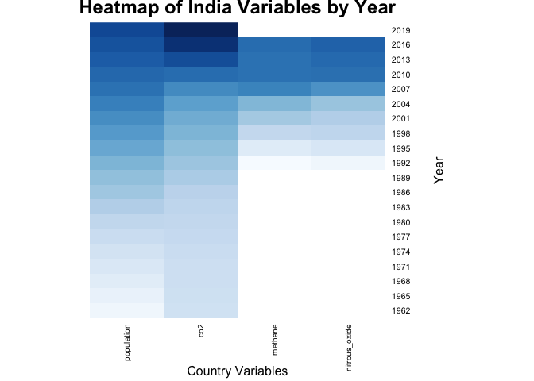<!-- -->

``` r
# Make a vector for the US
CO2_UnitedStates <- CO2_top3 %>% 
  # Filter US from Country Name
  filter(`Country Name`=='United States') %>% 
  #Mutate Variables to numeric 
  mutate_all(as.numeric) %>% 
  #Remove Country Name and year variables
  select(-'Country Name',-'year') %>% 
  #save as a matrix
  as.matrix
```

    ## Warning in mask$eval_all_mutate(quo): NAs introduced by coercion

``` r
# Label rows to correlating years
row.names(CO2_UnitedStates) <-c('1962','1965','1968','1971','1974','1977','1980','1983','1986','1989','1992','1995','1998','2001','2004','2007','2010','2013','2016','2019')

# Make a heatmap
heatmap(CO2_UnitedStates,scale='column',Colv = NA,Rowv= NA, xlab = 'Country Variables',ylab = 'Year', col = color, cexRow = 0.8, cexCol = 0.75,main = 'Heatmap of United States Variables by Year') 
```

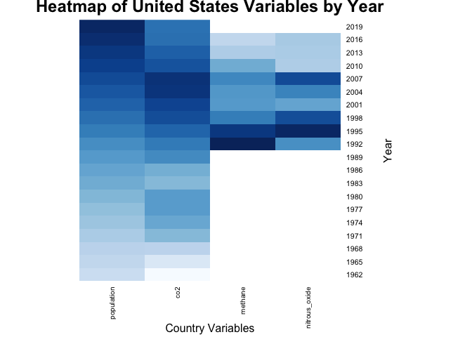<!-- -->

## Greenhouse Gas Emissions by Population

**For this graph, the total mean greenhouse gas emissons were observed
by population. Since the population of the United States is much lower
than that of China and India, it was removed. This graph shows the mean
of each greenhouse gas of China and India and plotted by population. It
can be seen that carbon dioxide greatly increases as population
increases. Methane and Nitrous Oxide do not show a strong relationship
with population, as they remain steady as population increases.**

``` r
# To observe the summary statistics of greenhouse gases by population, the US was removed because its population is much lower

# Make a new vector for Greenhouse gas info
CO2_plot <- CO2_top3 %>% 
  #Remove NAs
  na.omit() %>% 
  # Filter by 2 most populous countries
  filter(`Country Name` == c('China','India')) %>% 
  # Combine all greenhouse gases to one variable
  pivot_longer(cols = c('co2','methane','nitrous_oxide'),names_to = 'type',values_to = 'greenhouse gases')%>% 
  # Save as a data frame
  as.data.frame 
```

    ## Warning in `Country Name` == c("China", "India"): longer object length is not a
    ## multiple of shorter object length

``` r
# Plot greenhouse gas summary statistics
# Plot greenhouse gas emissions by population in millions
CO2_plot1 <- ggplot(CO2_plot, mapping = aes(population/1000000, `greenhouse gases`)) + 
  #geom_line with stat = 'summary' in aesthetics
  #take the mean of greenhouse gases
  #color by type of greenhouse gas
  geom_line(aes(y= `greenhouse gases`,stat= 'summary', fun.data = 'mean',color = type )) + 
  # add geom_point and color by type of greenhouse gas
  geom_point(aes(color = type)) + 
  #Add labels
  xlab('Population in Millions') + ylab('Mean Greenhouse Gas Emissions (ppm)') + ggtitle('Mean Greenhouse Gas Emissions by China and India') 
```

    ## Warning: Ignoring unknown aesthetics: stat, fun.data

``` r
# Plot with custom colors
CO2_plot1 + scale_color_manual(values = c("#00AFBB", "#E7B800", "#FC4E07"))
```

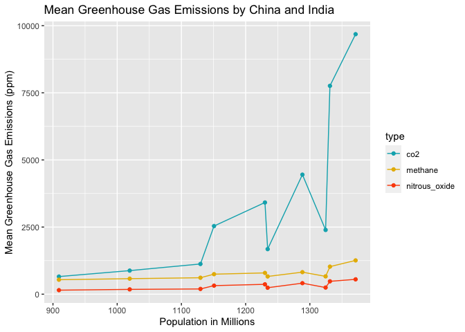<!-- -->

## Greenhouse Gas Emissions Over Time

**In order to visualize the change in greenhouse gases over time, a
graph was made for each greenhouse gas and was colored by country. It
can be seen that over time, emissions increase in each of the countries.
However, it can be seen that in the most recent years, the emissions in
the United States are seeing a decrease in their emissions.**

``` r
# Plot carbon dioxide emissions over time
co2_plot <- ggplot(CO2_top3, mapping= aes(year,co2)) + 
  #Add geom_point and color by country
  geom_point(aes(color= `Country Name`)) + 
  #Add labels
  xlab('Year') + ylab('Carbon Dioxide Emissions (ppm)') + ggtitle('Carbon Dioxide Emissions by Country Over Time') + 
  # Connect points with line and color by country
  geom_line(aes(color= `Country Name`))
# plot with custom colors
co2_plot + scale_color_manual(values = c("#00AFBB", "#E7B800", "#FC4E07"))
```

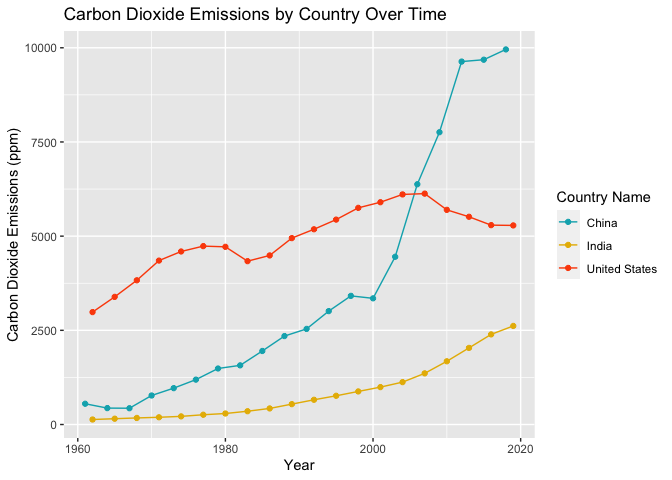<!-- -->

``` r
# Make a vector for methane emissions
methane_top3 <- CO2_top3 %>% select(methane,year,`Country Name`) %>% 
  #Remove NAs
  na.omit() 
# Plot methane emissions over time
methane_plot <- ggplot(methane_top3, mapping= aes(year,methane)) + 
  #Add geom_point and color by country 
  geom_point(aes(color= `Country Name`)) + 
  #Add labels
  xlab('Year') + ylab('Methane Emissions (ppm)') + ggtitle('Methane Emissions by Country Over Time') + 
  # Connect points with line and color by country
  geom_line(aes(color= `Country Name`))
#plot with custom colors
methane_plot + scale_color_manual(values = c("#00AFBB", "#E7B800", "#FC4E07"))
```

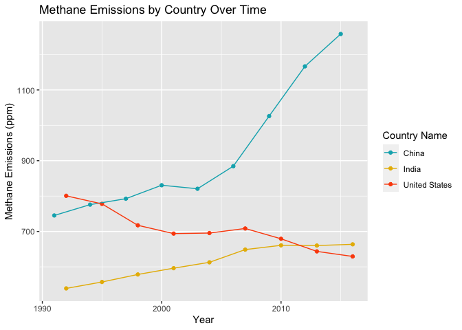<!-- -->

``` r
# Make a vector for nitrous oxide emissions
nox_top3 <- CO2_top3 %>% select(nitrous_oxide,year,`Country Name`) %>% 
  #Remove NAs
  na.omit
#Plot nitrous oxide emissions over time
nox_plot <- ggplot(nox_top3, mapping= aes(year,nitrous_oxide)) + 
  #Add geom_point and color by country 
  geom_point(aes(color= `Country Name`)) + 
  #Add labels
  xlab('Year') + ylab('Nitrous Oxide Emissions (ppm)') + ggtitle('Nitrous Oxide Emissions by Country Over Time') + 
  # Connect points with line and color by country 
  geom_line(aes(color= `Country Name`))
#Plot with custom colors
nox_plot + scale_color_manual(values = c("#00AFBB", "#E7B800", "#FC4E07"))
```

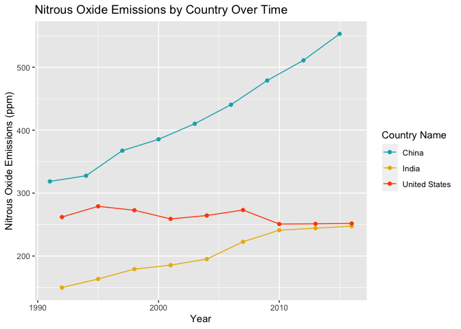<!-- -->

## Principal Component Analysis (PCA)

**PCA was performed in order to differentiate the different countries by
population, CO2 emissions, methane emissions, and nitrous oxide
emissions. It can be seen that the United States is tightly grouped and
well differentiated from the other two countries, most likely due to the
high variance in population. Between the two compenents, 98.09% of
variance is explained in the plot, with 68.39% being in PC1 and 29.70%
in PC2. The year variable was removed since this is not a dependent
numeric value.**

``` r
# Make a vector for all gases, remove NAs, and remove year variable
gas_top3 <- CO2_top3 %>% na.omit() %>% select(-year)
# Prepare data for PCA
gas_PCA <- gas_top3 %>% select_if(is.numeric) %>% scale() %>% prcomp()
gas_PCA
```

    ## Standard deviations (1, .., p=4):
    ## [1] 1.6539299 1.0899216 0.2074827 0.1831333
    ## 
    ## Rotation (n x k) = (4 x 4):
    ##                      PC1         PC2         PC3        PC4
    ## population    -0.1914831  0.86680069 -0.07167985  0.4548107
    ## co2           -0.5061101 -0.48720100 -0.19281343  0.6850625
    ## methane       -0.5958364  0.03552735  0.77802395 -0.1959477
    ## nitrous_oxide -0.5934355  0.10014766 -0.59360232 -0.5342668

``` r
# Save x variables as a data frame
PCA1 <- as.data.frame(gas_PCA$x)
# Bind columns
PCA2 <- bind_cols(PCA1, gas_top3['Country Name'])

# Plot the PCA data and color by country
pca_plot <- ggplot(PCA2, mapping = aes(PC1,PC2,color = `Country Name`)) + geom_point() + ggtitle('PCA by Country')
# Plot with custom colors
pca_plot + scale_color_manual(values = c("#00AFBB", "#E7B800", "#FC4E07"))
```

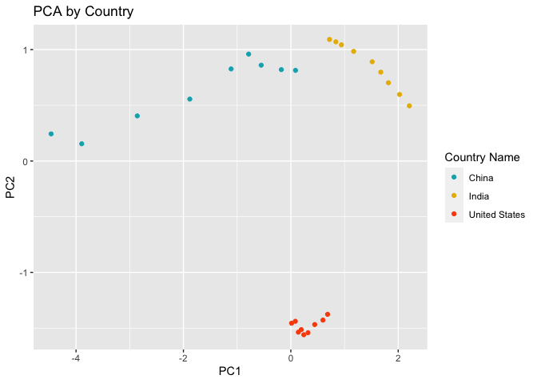<!-- -->

``` r
# Save the rotation matrix as a data frame
rotation_data <- data.frame(gas_PCA$rotation, 
  variable = row.names(gas_PCA$rotation))

# Define an arrow style
arrow_style <- arrow(length = unit(0.05, "inches"), type = "open")

# Plot the contribution of variables to PCs using geom_segment() for arrows and geom_text() for labels
ggplot(rotation_data) + 
  geom_segment(aes(xend = PC1, yend = PC2), x = 0, y = 0, arrow = arrow_style) + 
  geom_text(aes(x = PC1, y = PC2, label = variable), hjust = 0, size = 3, color = "#00AFBB") + 
  xlim(-1., 1.25) + 
  ylim(-1., 1.) +
  coord_fixed() + ggtitle('Contribution of Variables')
```

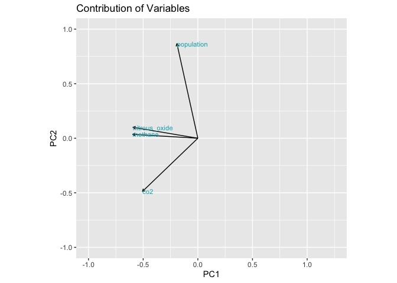<!-- -->

``` r
# Determine the percentage of variance explained by each component with sdev
percent <- 100* (gas_PCA$sdev^2 / sum(gas_PCA$sdev^2))

# Visualize the percentage of variance explained by each component
perc_data <- data.frame(percent = percent, PC = 1:length(percent))
ggplot(perc_data, aes(x = PC, y = percent)) + 
  geom_col(fill = "#00AFBB") + 
  geom_text(aes(label = round(percent, 2)), size = 4, vjust = -0.5) + 
  ylim(0, 80) + ggtitle('PCA Percentages')
```

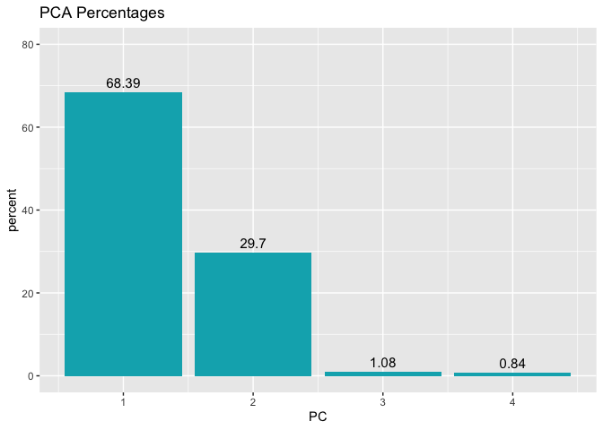<!-- -->
