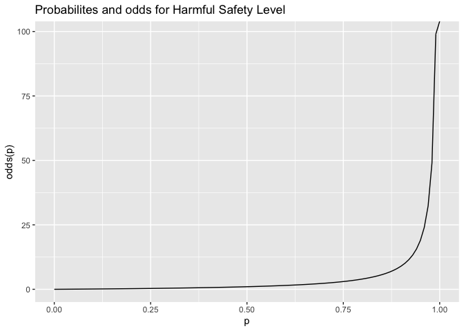

Greenhouse Gas Emissions in China
================
Morgan Hagood

## References:

*Mathieu, H. R. M. R. (2021). Data on CO2 and Greenhouse Gas Emissions
by Our World in Data \[Data set\]. Retrieved from
<https://github.com/owid/co2-data> (Original work published 2020)*

*The World Bank. ( 1 ) United Nations Population Division. World
Population Prospects: 2019 Revision. ( 2 ) Census reports and other
statistical publications from national statistical offices, ( 3 )
Eurostat: Demographic Statistics, ( 4 ) United Nations Statistical
Division. Population and Vital Statistics Reprot ( various years ), ( 5
) U.S. Census Bureau: International Database, and ( 6 ) Secretariat of
the Pacific Community: Statistics and Demography Programme. (2019).
Population, total \[Data set\]. Retrieved from
<https://data.worldbank.org/indicator/SP.POP.TOTL>*

*Minnesota Dept. of Health. (n.d.). Carbon dioxide (CO2). Retrieved
April 21, 2021, from State.mn.us website:
<https://www.health.state.mn.us/communities/environment/air/toxins/co2.html>*

# Load packages and Import Datasets

**For this project, I wanted to observe greenhouse gas emissions by the
top most populous country in the world, which is China. The datasets
were excel files from Our World in Data and The World Bank. I also
manually made an emissions safety level dataset using safety
measurements from the Minnesota Department of Health. One dataset was
population data by country, the other was greenhouse gas emissions by
country, and last was a safety level by carbon dioxide emission level.
The greenhouse gas data contained many variables about the source of the
carbon dioxide emissions and growth percentages of emissions, etc., but
I chose to focus on the total carbon dioxide emissions, total methane
emissions, total nitrous oxide emissions, year, and country names. The
population data contained country name variabes, country codes, and the
population of each country by year. The safety level dataset contained
the variables, “Harmful” or “Unharmful,” based on the carbon dioxide ppm
effects on the human body. This dataset was only made for the country of
China and contained the carbon dioxide levels. I was interested in
seeing if there was a relationship between an increase in population and
greenhouse gas emissions. I suspected that there would also be
relationships between population and emissions by year.**

``` r
# Load necessary packages
library(tidyverse)
```

    ## ── Attaching packages ─────────────────────────────────────── tidyverse 1.3.1 ──

    ## ✓ ggplot2 3.3.3     ✓ purrr   0.3.4
    ## ✓ tibble  3.1.1     ✓ dplyr   1.0.5
    ## ✓ tidyr   1.1.3     ✓ stringr 1.4.0
    ## ✓ readr   1.4.0     ✓ forcats 0.5.1

    ## ── Conflicts ────────────────────────────────────────── tidyverse_conflicts() ──
    ## x dplyr::filter() masks stats::filter()
    ## x dplyr::lag()    masks stats::lag()

``` r
library(ggplot2)
library(dplyr)
library(readxl)
library(RColorBrewer)
library(factoextra)
```

    ## Welcome! Want to learn more? See two factoextra-related books at https://goo.gl/ve3WBa

``` r
library(lmtest)
```

    ## Loading required package: zoo

    ## 
    ## Attaching package: 'zoo'

    ## The following objects are masked from 'package:base':
    ## 
    ##     as.Date, as.Date.numeric

``` r
library(sandwich)
library(plotROC) 

# I found datasets of the world population and greenhouse gas emissions by every country in the world
# Import datasets and set as working directory
pop_data <- read_excel("~/Downloads/API_SP.POP.TOTL_DS2_en_excel_v2_2106205.xls")
CO2_data <- read_excel("~/Desktop/owid-co2-data.xlsx")
CO2_safety <- read_excel("~/Downloads/co2-safety_data.xlsx")

# View the data using head()
head(pop_data)
```

    ## # A tibble: 6 x 65
    ##   `Country Name` `Country Code` `Indicator Name`  `Indicator Code` `1960` `1961`
    ##   <chr>          <chr>          <chr>             <chr>             <dbl>  <dbl>
    ## 1 Aruba          ABW            Population, total SP.POP.TOTL      5.42e4 5.54e4
    ## 2 Afghanistan    AFG            Population, total SP.POP.TOTL      9.00e6 9.17e6
    ## 3 Angola         AGO            Population, total SP.POP.TOTL      5.45e6 5.53e6
    ## 4 Albania        ALB            Population, total SP.POP.TOTL      1.61e6 1.66e6
    ## 5 Andorra        AND            Population, total SP.POP.TOTL      1.34e4 1.44e4
    ## 6 Arab World     ARB            Population, total SP.POP.TOTL      9.22e7 9.47e7
    ## # … with 59 more variables: 1962 <dbl>, 1963 <dbl>, 1964 <dbl>, 1965 <dbl>,
    ## #   1966 <dbl>, 1967 <dbl>, 1968 <dbl>, 1969 <dbl>, 1970 <dbl>, 1971 <dbl>,
    ## #   1972 <dbl>, 1973 <dbl>, 1974 <dbl>, 1975 <dbl>, 1976 <dbl>, 1977 <dbl>,
    ## #   1978 <dbl>, 1979 <dbl>, 1980 <dbl>, 1981 <dbl>, 1982 <dbl>, 1983 <dbl>,
    ## #   1984 <dbl>, 1985 <dbl>, 1986 <dbl>, 1987 <dbl>, 1988 <dbl>, 1989 <dbl>,
    ## #   1990 <dbl>, 1991 <dbl>, 1992 <dbl>, 1993 <dbl>, 1994 <dbl>, 1995 <dbl>,
    ## #   1996 <dbl>, 1997 <dbl>, 1998 <dbl>, 1999 <dbl>, 2000 <dbl>, 2001 <dbl>,
    ## #   2002 <dbl>, 2003 <dbl>, 2004 <dbl>, 2005 <dbl>, 2006 <dbl>, 2007 <dbl>,
    ## #   2008 <dbl>, 2009 <dbl>, 2010 <dbl>, 2011 <dbl>, 2012 <dbl>, 2013 <dbl>,
    ## #   2014 <dbl>, 2015 <dbl>, 2016 <dbl>, 2017 <dbl>, 2018 <dbl>, 2019 <dbl>,
    ## #   2020 <lgl>

``` r
head(CO2_data)
```

    ## # A tibble: 6 x 55
    ##   iso_code country     year   co2 co2_growth_prct co2_growth_abs consumption_co2
    ##   <chr>    <chr>      <dbl> <dbl>           <dbl>          <dbl>           <dbl>
    ## 1 AFG      Afghanist…  1949 0.015           NA            NA                  NA
    ## 2 AFG      Afghanist…  1950 0.084          475             0.07               NA
    ## 3 AFG      Afghanist…  1951 0.092            8.70          0.007              NA
    ## 4 AFG      Afghanist…  1952 0.092           NA            NA                  NA
    ## 5 AFG      Afghanist…  1953 0.106           16             0.015              NA
    ## 6 AFG      Afghanist…  1954 0.106           NA            NA                  NA
    ## # … with 48 more variables: trade_co2 <dbl>, trade_co2_share <dbl>,
    ## #   co2_per_capita <dbl>, consumption_co2_per_capita <dbl>,
    ## #   share_global_co2 <dbl>, cumulative_co2 <dbl>,
    ## #   share_global_cumulative_co2 <dbl>, co2_per_gdp <dbl>,
    ## #   consumption_co2_per_gdp <dbl>, co2_per_unit_energy <dbl>, cement_co2 <dbl>,
    ## #   coal_co2 <dbl>, flaring_co2 <dbl>, gas_co2 <dbl>, oil_co2 <dbl>,
    ## #   other_industry_co2 <lgl>, cement_co2_per_capita <dbl>,
    ## #   coal_co2_per_capita <dbl>, flaring_co2_per_capita <dbl>,
    ## #   gas_co2_per_capita <dbl>, oil_co2_per_capita <dbl>,
    ## #   other_co2_per_capita <lgl>, share_global_coal_co2 <dbl>,
    ## #   share_global_oil_co2 <dbl>, share_global_gas_co2 <dbl>,
    ## #   share_global_flaring_co2 <dbl>, share_global_cement_co2 <dbl>,
    ## #   cumulative_coal_co2 <dbl>, cumulative_oil_co2 <dbl>,
    ## #   cumulative_gas_co2 <dbl>, cumulative_flaring_co2 <dbl>,
    ## #   cumulative_cement_co2 <dbl>, share_global_cumulative_coal_co2 <dbl>,
    ## #   share_global_cumulative_oil_co2 <dbl>,
    ## #   share_global_cumulative_gas_co2 <dbl>,
    ## #   share_global_cumulative_flaring_co2 <dbl>,
    ## #   share_global_cumulative_cement_co2 <dbl>, total_ghg <dbl>,
    ## #   ghg_per_capita <dbl>, methane <dbl>, methane_per_capita <dbl>,
    ## #   nitrous_oxide <dbl>, nitrous_oxide_per_capita <dbl>,
    ## #   primary_energy_consumption <dbl>, energy_per_capita <dbl>,
    ## #   energy_per_gdp <dbl>, population <dbl>, gdp <dbl>

``` r
head(CO2_safety)
```

    ## # A tibble: 6 x 4
    ##   country  year    co2 Level    
    ##   <chr>   <dbl>  <dbl> <chr>    
    ## 1 China    1899  0.095 Unharmful
    ## 2 China    1902  0.095 Unharmful
    ## 3 China    1903  1.96  Unharmful
    ## 4 China    1904  2.09  Unharmful
    ## 5 China    1905  2.30  Unharmful
    ## 6 China    1906 17.1   Unharmful

# Tidy Data and Merge

**The population dataset and greenhouse gas dataset were merged using
left\_join by their similar variables of country name, year, and country
code. The populations were not merged because the population variabale
in the greenhouse gas data was not exact, so it was removed from the
merged dataset. The variables Country Name, year, population, CO2,
methane, and nitrous gas were selected to observe. The most populous
country, China was selected to observe.**

    ## # A tibble: 264 x 7
    ##    `Country Name`              year population   co2 methane nitrous_oxide Level
    ##    <chr>                      <dbl>      <dbl> <dbl>   <dbl>         <dbl> <chr>
    ##  1 World                       2019 7673533974    NA      NA            NA <NA> 
    ##  2 IDA & IBRD total            2019 6486934853    NA      NA            NA <NA> 
    ##  3 Low & middle income         2019 6437681136    NA      NA            NA <NA> 
    ##  4 Middle income               2019 5769226171    NA      NA            NA <NA> 
    ##  5 IBRD only                   2019 4816235953    NA      NA            NA <NA> 
    ##  6 Early-demographic dividend  2019 3290290613    NA      NA            NA <NA> 
    ##  7 Lower middle income         2019 2913363391    NA      NA            NA <NA> 
    ##  8 Upper middle income         2019 2855862780    NA      NA            NA <NA> 
    ##  9 East Asia & Pacific         2019 2340628292    NA      NA            NA <NA> 
    ## 10 Late-demographic dividend   2019 2298470832    NA      NA            NA <NA> 
    ## # … with 254 more rows

# EDA

**In order to explore and analyze the data, summary statistics, a
scatterplot, a representation of means plot, and correlation matrix were
made. For this project, I wanted to observe the effect of population
(and the interaction with year) on greenhouse gas emissions. Summary
statistics revealed statistics related to carbon dioxide emissions in
ppm, showing a very high mean of 5582.446 and high correlation values
with population and year as 0.9094569 and 0.9564363, respectively. The
scatterplot showed the general trend of the increase of Carbon Dioxide
emissions by the increase in population. There is a rapid increase in
reponse to the highest population sizes. The means of all three
greenhouse gases were observed versus population. Carbon Dioxide was by
far the greatest, which is why it was further observed later in the
project. As seen in the correlation matrix, there are strong
correlations across all the variables, with the correlation between
population and carbon dioxide being 0.85 and with year, 0.92. **

## Summary Statistics

#### The summary statistics for carbon dioxide was observed. The summary statistics included mean, median, standard deviation, variance, minimum, maximum, distinct number, 25% quantile, 75% quantile, corrrelation between population and CO2, and the correlation between the year and CO2.

``` r
co2_stats <- CO2_China  %>% drop_na() %>%
  # Find the summary statistics of carbon dioxide
  summarize(mean(co2), median(co2),sd(co2),var(co2),min(co2),max(co2),n_distinct(co2),quantile(co2,0.25),quantile(co2,0.75),cor(year, co2), cor(population, co2)) %>% as.data.frame
print.data.frame(co2_stats)
```

    ##   mean(co2) median(co2)  sd(co2) var(co2) min(co2) max(co2) n_distinct(co2)
    ## 1  5582.446     4452.31 2772.793  7688379 2420.789  9820.36              27
    ##   quantile(co2, 0.25) quantile(co2, 0.75) cor(year, co2) cor(population, co2)
    ## 1             3265.48            8129.677      0.9564363            0.9094569

## Scatterplot

``` r
# Scatterplot of Population vs. Carbon Dioxide emissions for China to observe the relationship
ggplot(CO2_China, aes(population/100000,co2)) +
  geom_point()  +
  xlab("Population in Millions") + ylab("Carbon Dioxide Emissions (ppm)") + ggtitle("Scatterplot of Carbon Dioxide Emissions by Population in China")
```

    ## Warning: Removed 1 rows containing missing values (geom_point).

<!-- -->

## Representation of Means

``` r
# Observe how the means of carbon dioxide emissions differs by population
CO2_China %>%
  group_by(`Country Name`) %>%
  summarize(mean(population), mean(co2))
```

    ## # A tibble: 1 x 3
    ##   `Country Name` `mean(population)` `mean(co2)`
    ##   <chr>                       <dbl>       <dbl>
    ## 1 China                          NA          NA

``` r
# Represent the means per country for all greenhouse gases 
CO2_China %>%
  select(`Country Name`,co2, methane, nitrous_oxide) %>%
  pivot_longer(-1,names_to='DV', values_to='measure') %>%
  ggplot(aes(`Country Name`,measure,fill=`Country Name`)) +
  geom_bar(stat="summary", fun = "mean") +
  geom_errorbar(stat="summary", fun.data = "mean_se", width=.5) +
  facet_wrap(~DV, nrow=2) +
  coord_flip() + 
  ylab("") + 
  theme(legend.position = "none") + ggtitle("Representation of Means")
```

    ## Warning: Removed 69 rows containing non-finite values (stat_summary).

    ## Warning: Removed 69 rows containing non-finite values (stat_summary).

<!-- -->

## Correlation Matrix Heatmap

``` r
# Save data as a data frame
country.data.cor <- CO2_China %>% as.data.frame

# Build a correlation matrix between all numeric variables
country_cor_num <- country.data.cor %>% select_if(is.numeric) 
cor(country_cor_num, use = "pairwise.complete.obs")
```

    ##                    year population       co2   methane nitrous_oxide
    ## year          1.0000000  0.9873913 0.9192492 0.9227117     0.9858012
    ## population    0.9873913  1.0000000 0.8511021 0.8637325     0.9627949
    ## co2           0.9192492  0.8511021 1.0000000 0.9611702     0.9635360
    ## methane       0.9227117  0.8637325 0.9611702 1.0000000     0.9538402
    ## nitrous_oxide 0.9858012  0.9627949 0.9635360 0.9538402     1.0000000

``` r
# Make a correlation matrix heatmap
cor(country_cor_num, use = "pairwise.complete.obs") %>%
  # Save as a data frame
  as.data.frame %>%
  # Convert row names to variable
  rownames_to_column %>%
  # Pivot so that all correlations appear in the same column
  pivot_longer(-1, names_to = "other_var", values_to = "correlation") %>%
  ggplot(aes(rowname, other_var, fill=correlation)) +
  # Heatmap with geom_tile
  geom_tile() +
  # Change the scale to make the middle appear neutral
  scale_fill_gradient2(low="#FC4E07",mid="white",high="#00AFBB") + 
  # Overlay values
  geom_text(aes(label = round(correlation,2)), color = "black", size = 4) +
  # Give title and labels
  labs(title = "Correlation matrix Heatmap for China", x = "variable 1", y = "variable 2")
```

<!-- -->

# MANOVA

**A MANOVA test was ran for China for Carbon Dioxide emissions and
population with emissions safety levels. The assumptions include that
observations are random and independently sampled, each dependent
variable has a unique independent variable, and the dependent variable
is normally distributed. The results from China show significance for
both Carbon Dioxide emissions and population with emissions safety
levels because of the low p-values in the post-hoc tests. These results
were still significant after a Bonferroni correction. This adjusted
alpha level decreased the chances of a type 1 error. Overall, the null
hypothesis that population does not have an effect on carbon dioxide
emissions was rejected.**

``` r
# MANOVA with greenhouse gases listed in cbind() for China
manova_china <- manova(cbind(co2,population) ~ Level, data = CO2_China)
# Output of MANOVA
summary(manova_china)
```

    ##           Df  Pillai approx F num Df den Df    Pr(>F)    
    ## Level      1 0.77769     99.7      2     57 < 2.2e-16 ***
    ## Residuals 58                                             
    ## ---
    ## Signif. codes:  0 '***' 0.001 '**' 0.01 '*' 0.05 '.' 0.1 ' ' 1

``` r
# one-way ANOVA for each variable for China
summary.aov(manova_china)
```

    ##  Response co2 :
    ##             Df    Sum Sq   Mean Sq F value    Pr(>F)    
    ## Level        1 308010840 308010840  58.001 2.703e-10 ***
    ## Residuals   58 308003926   5310413                      
    ## ---
    ## Signif. codes:  0 '***' 0.001 '**' 0.01 '*' 0.05 '.' 0.1 ' ' 1
    ## 
    ##  Response population :
    ##             Df     Sum Sq    Mean Sq F value    Pr(>F)    
    ## Level        1 2.4603e+18 2.4603e+18  196.08 < 2.2e-16 ***
    ## Residuals   58 7.2778e+17 1.2548e+16                      
    ## ---
    ## Signif. codes:  0 '***' 0.001 '**' 0.01 '*' 0.05 '.' 0.1 ' ' 1
    ## 
    ## 1 observation deleted due to missingness

``` r
# Post-hoc analysis
# for carbon dioxide
pairwise.t.test(CO2_China$co2,CO2_China$Level, p.adj="none")
```

    ## 
    ##  Pairwise comparisons using t tests with pooled SD 
    ## 
    ## data:  CO2_China$co2 and CO2_China$Level 
    ## 
    ##           Harmful
    ## Unharmful 2.7e-10
    ## 
    ## P value adjustment method: none

``` r
# for population
pairwise.t.test(CO2_China$population,CO2_China$Level, p.adj="none")
```

    ## 
    ##  Pairwise comparisons using t tests with pooled SD 
    ## 
    ## data:  CO2_China$population and CO2_China$Level 
    ## 
    ##           Harmful
    ## Unharmful <2e-16 
    ## 
    ## P value adjustment method: none

``` r
#Bonferroni correction
0.05/58
```

    ## [1] 0.000862069

# Randomization Test

**Randomization tests were conducted for China with emissions safety
levels and population size. The distribution of the mean differences
were much below the true mean difference. The Welch two-sample t-test
showed that the mean for Harmful safety levels was much higher than
Unharmful. Therefore, the null was rejected that the true means was
equal to zero. The observed test statistic is not visible to the
distribution because it was much higher.This gives more evidence agains
the null hypothesis.**

``` r
safety_china <- CO2_top3 %>% select(-methane,-nitrous_oxide) %>% filter(`Country Name`=='China') 

# Represent the distribution of population for each safety level
ggplot(safety_china, aes(population/1000000,fill= Level)) +
  geom_histogram(bins=6.5) +
  facet_wrap(~Level,ncol=2) +
  theme(legend.position="none") + ggtitle("Distribution of Population in Millions for Each Safety Level")
```

<!-- -->

``` r
# Calculate the mean difference between the different safety levels
true_diff <- safety_china %>%
  group_by(Level) %>%
  summarize(means = mean(population)) %>%
  summarize(mean_diff = diff(means)) %>%
  pull
true_diff
```

    ## [1] -407467273

``` r
# resample population across safety levels
random1 <- data.frame(safety = safety_china$Level, population = sample(safety_china$population))
head(random1)
```

    ##      safety population
    ## 1 Unharmful 1311020000
    ## 2 Unharmful 1371220000
    ## 3 Unharmful  930685000
    ## 4 Unharmful  969005000
    ## 5 Unharmful 1331260000
    ## 6 Unharmful 1191835000

``` r
# Find the new mean difference
random1 %>% 
  group_by(safety) %>%
  summarize(means_china = mean(population)) %>%
  summarize(mean_diff_china = diff(means_china))
```

    ## # A tibble: 1 x 1
    ##   mean_diff_china
    ##             <dbl>
    ## 1      218046869.

``` r
# resample population across safety levels again
random1.2 <- data.frame(safety = safety_china$Level, population = sample(safety_china$population))
head(random1.2)
```

    ##      safety population
    ## 1 Unharmful 1331260000
    ## 2 Unharmful  698355000
    ## 3 Unharmful 1311020000
    ## 4 Unharmful 1051040000
    ## 5 Unharmful 1262645000
    ## 6 Unharmful 1150780000

``` r
# Find the new mean difference
random1.2 %>% 
  group_by(safety) %>%
  summarize(means_china = mean(population)) %>%
  summarize(mean_diff_china = diff(means_china))
```

    ## # A tibble: 1 x 1
    ##   mean_diff_china
    ##             <dbl>
    ## 1      -94586465.

``` r
# empty vector to store the mean differences 
mean_diff_china <- vector()

# Compute many randomization with a for loop
for(i in 1:5000){ 
  test1 <- data.frame(safety = safety_china$Level, population = sample(safety_china$population)) 
  
  mean_diff_china[i] <- test1 %>% 
    group_by(safety) %>%
    summarize(means_china = mean(population)) %>%
    summarize(mean_diff_china = diff(means_china)) %>%
    pull
}

# Represent the distribution of the mean differences with a vertical line showing the true difference
{hist(mean_diff_china, main="Distribution of the mean differences"); abline(v = 407467273, col="red")}
```

<!-- -->

``` r
# Calculate the corresponding two-sided p-value
mean(mean_diff_china > -true_diff | mean_diff_china < true_diff)
```

    ## [1] 0

``` r
# Compare to a Welch's t-test
t.test(data = safety_china, population ~ Level)
```

    ## 
    ##  Welch Two Sample t-test
    ## 
    ## data:  population by Level
    ## t = 7.5053, df = 13.558, p-value = 3.469e-06
    ## alternative hypothesis: true difference in means is not equal to 0
    ## 95 percent confidence interval:
    ##  290668443 524266103
    ## sample estimates:
    ##   mean in group Harmful mean in group Unharmful 
    ##              1271117273               863650000

# Linear Regression

**Linear regression was performed on China for Carbon Dioxide emissions
and the interaction between population and year. The linear regression
model showed that for every 1 unit change in population there is a
-1.518e-05 change in CO2 emissions., controlling for year. For every 1
unit change in year, there is a 6.015e+02 change in CO2 emissions. For
the interaction, for every 1 unit change in year and population, there
is a -8.524e-09 change in CO2 emissions. The center means of the
predictors, year and population were taken. When the population is
centered by its mean, for every 1 unit change in year, there is a
5.922e+02 chhange in CO2 emissions. When the year is centered by its
mean, for every 1 unit change in population, there is a -3.214e-05
change in CO2 emissions. The relations are plotted with regression lines
with and without the interaction. Both plots show a positive regression
line. When variation in year and carbon dioxide with population were
removed, the coefficients only varied slightly, with there being a
5.824042e+02 change in CO2 emissions for every 1 unit increase in year.
Overall, the model was a good fit, with it having an R-squared value of
0.9727.** **Assumptions were checked and signified that the data was
normal and the data do not differ much from normal distribution,but
homoscedasticity and linearity were rejected, meaning that bootstrapping
and robust standard error had to be performed.** **After bootstrapping
the data and taking the robust standard errors, the data was unbiased
and more accurately observed. The results from China showed positive
correlation coefficients of population and year with carbon dioxide
emissions, but their interaction was negative. Their t-values were all
significant. Overall, the results show that year and population have
significant effects on carbon dioxide emissions.**

\#\#MLR for China

``` r
# multiple linear regression model with carbon dioxide and population in China
fit1 <- lm(co2 ~ population * year, data = CO2_China)
summary(fit1)
```

    ## 
    ## Call:
    ## lm(formula = co2 ~ population * year, data = CO2_China)
    ## 
    ## Residuals:
    ##      Min       1Q   Median       3Q      Max 
    ## -1081.51  -387.44    30.95   336.47  1310.46 
    ## 
    ## Coefficients:
    ##                   Estimate Std. Error t value Pr(>|t|)    
    ## (Intercept)     -1.158e+06  2.636e+05  -4.393 5.03e-05 ***
    ## population      -1.518e-05  1.131e-04  -0.134    0.894    
    ## year             6.015e+02  1.357e+02   4.433 4.39e-05 ***
    ## population:year -8.524e-09  5.953e-08  -0.143    0.887    
    ## ---
    ## Signif. codes:  0 '***' 0.001 '**' 0.01 '*' 0.05 '.' 0.1 ' ' 1
    ## 
    ## Residual standard error: 548.2 on 56 degrees of freedom
    ##   (1 observation deleted due to missingness)
    ## Multiple R-squared:  0.9727, Adjusted R-squared:  0.9712 
    ## F-statistic: 664.5 on 3 and 56 DF,  p-value: < 2.2e-16

``` r
#Mean Center Predictors
CO2_China$population_c <- CO2_China$population - mean(CO2_China$population, na.rm = T)
fit1.2 <- lm(co2 ~ population_c * year, data = CO2_China)
summary(fit1.2) 
```

    ## 
    ## Call:
    ## lm(formula = co2 ~ population_c * year, data = CO2_China)
    ## 
    ## Residuals:
    ##      Min       1Q   Median       3Q      Max 
    ## -1081.51  -387.44    30.95   336.47  1310.46 
    ## 
    ## Coefficients:
    ##                     Estimate Std. Error t value Pr(>|t|)    
    ## (Intercept)       -1.175e+06  1.453e+05  -8.083 5.65e-11 ***
    ## population_c      -1.518e-05  1.131e-04  -0.134    0.894    
    ## year               5.922e+02  7.315e+01   8.095 5.39e-11 ***
    ## population_c:year -8.524e-09  5.953e-08  -0.143    0.887    
    ## ---
    ## Signif. codes:  0 '***' 0.001 '**' 0.01 '*' 0.05 '.' 0.1 ' ' 1
    ## 
    ## Residual standard error: 548.2 on 56 degrees of freedom
    ##   (1 observation deleted due to missingness)
    ## Multiple R-squared:  0.9727, Adjusted R-squared:  0.9712 
    ## F-statistic: 664.5 on 3 and 56 DF,  p-value: < 2.2e-16

``` r
CO2_China$year_c <- CO2_China$year - mean(CO2_China$year, na.rm = T)
fit1.3 <- lm(co2 ~ year_c * population, data = CO2_China)
summary(fit1.3) 
```

    ## 
    ## Call:
    ## lm(formula = co2 ~ year_c * population, data = CO2_China)
    ## 
    ## Residuals:
    ##      Min       1Q   Median       3Q      Max 
    ## -1081.51  -387.44    30.95   336.47  1310.46 
    ## 
    ## Coefficients:
    ##                     Estimate Std. Error t value Pr(>|t|)    
    ## (Intercept)        3.889e+04  6.480e+03   6.002 1.51e-07 ***
    ## year_c             6.015e+02  1.357e+02   4.433 4.39e-05 ***
    ## population        -3.214e-05  5.719e-06  -5.620 6.25e-07 ***
    ## year_c:population -8.524e-09  5.953e-08  -0.143    0.887    
    ## ---
    ## Signif. codes:  0 '***' 0.001 '**' 0.01 '*' 0.05 '.' 0.1 ' ' 1
    ## 
    ## Residual standard error: 548.2 on 56 degrees of freedom
    ##   (1 observation deleted due to missingness)
    ## Multiple R-squared:  0.9727, Adjusted R-squared:  0.9712 
    ## F-statistic: 664.5 on 3 and 56 DF,  p-value: < 2.2e-16

``` r
# Plot of the relationship with the regression line
CO2_China %>% 
  ggplot(aes(population/1000000,co2)) +
  geom_point() +
  geom_smooth(method = 'lm', se = FALSE) + xlab("Population in Millions") + ylab("Carbon Dioxide Emissions (ppm)") + ggtitle("MLR Relationship Between Carbon Dioxide and Population in China")
```

    ## `geom_smooth()` using formula 'y ~ x'

    ## Warning: Removed 1 rows containing non-finite values (stat_smooth).

    ## Warning: Removed 1 rows containing missing values (geom_point).

<!-- -->

``` r
#Interaction Graph
ggplot(CO2_China, aes(x = population/1000000, y = co2, color = year)) +
  geom_point() +
  geom_smooth(method=lm, se=FALSE, fullrange=TRUE, color = 'red')
```

    ## `geom_smooth()` using formula 'y ~ x'

    ## Warning: Removed 1 rows containing non-finite values (stat_smooth).

    ## Warning: Removed 1 rows containing missing values (geom_point).

<!-- -->

``` r
# Remove variation in carbon dioxide shared with population
resco2_china <- lm(co2 ~ population, data = CO2_China)$residuals
# Remove variation in year shared with population
resyear_china <- lm(year ~ population, data = CO2_China)$residuals
# Regress the residuals carbon dioxide on residuals year (population removed)
coef(lm(resco2_china ~ resyear_china)) 
```

    ##   (Intercept) resyear_china 
    ## -1.724464e-14  5.824042e+02

``` r
# Compare to the coefficients obtained in the MLR
coef(lm(co2 ~ population * year, data = CO2_China))
```

    ##     (Intercept)      population            year population:year 
    ##   -1.158046e+06   -1.518163e-05    6.014765e+02   -8.523558e-09

\#\#Assumptions for China

``` r
# Check assumptions for China
# Linearity and homoscedasticity
plot(fit1, which = 1)
```

<!-- -->

``` r
bptest(fit1)
```

    ## 
    ##  studentized Breusch-Pagan test
    ## 
    ## data:  fit1
    ## BP = 15.746, df = 3, p-value = 0.001278

``` r
# Normality
plot(fit1, which = 2)
```

<!-- -->

``` r
shapiro.test(fit1$residuals)
```

    ## 
    ##  Shapiro-Wilk normality test
    ## 
    ## data:  fit1$residuals
    ## W = 0.98276, p-value = 0.5555

``` r
# Histogram of residuals
hist(fit1$residuals)
```

<!-- -->

``` r
# Kolmogorov-Smirnov test
ks.test(fit1$residuals, "pnorm", mean=0, sd(fit1$residuals))
```

    ## 
    ##  One-sample Kolmogorov-Smirnov test
    ## 
    ## data:  fit1$residuals
    ## D = 0.067128, p-value = 0.9329
    ## alternative hypothesis: two-sided

## Boostrapping and Robust Standard Errors for China

``` r
# Robust Standard Errors for China
coeftest(fit1, vcov = vcovHC(fit1))
```

    ## 
    ## t test of coefficients:
    ## 
    ##                    Estimate  Std. Error t value Pr(>|t|)  
    ## (Intercept)     -1.1580e+06  4.6441e+05 -2.4936  0.01563 *
    ## population      -1.5182e-05  2.0122e-04 -0.0754  0.94013  
    ## year             6.0148e+02  2.3883e+02  2.5184  0.01467 *
    ## population:year -8.5236e-09  1.0582e-07 -0.0805  0.93609  
    ## ---
    ## Signif. codes:  0 '***' 0.001 '**' 0.01 '*' 0.05 '.' 0.1 ' ' 1

``` r
# Use the function replicate to repeat the process 
samp_SEs_china <- replicate(5000, {
  # Bootstrap data 
  boot_data_china <- sample_frac(CO2_China, replace = TRUE)
  # Fit regression model
  fitboot_china <- lm(co2 ~ population * year, data = boot_data_china)
  # Save the coefficients
  coef(fitboot_china)
})

# Estimated SEs
samp_SEs_china %>%
  # Transpose the obtained matrices
  t %>%
  # Consider the matrix as a data frame
  as.data.frame %>%
  # Compute the standard error 
  summarize_all(sd)
```

    ##   (Intercept)   population     year population:year
    ## 1    378673.3 0.0001610118 194.8309    8.479799e-08

``` r
# confidence interval for the estimates
samp_SEs_china %>%
  # Transpose the obtained matrices
  t %>%
  # Consider the matrix as a data frame
  as.data.frame %>%
  # Pivot longer to group by and summarize each coefficient
  pivot_longer(everything(), names_to = "estimates", values_to = "value") %>%
  group_by(estimates) %>%
  summarize(lower = quantile(value,.025), upper = quantile(value,.975))
```

    ## # A tibble: 4 x 3
    ##   estimates          lower    upper
    ##   <chr>              <dbl>    <dbl>
    ## 1 (Intercept)     -2.03e+6 -5.93e+5
    ## 2 population      -2.48e-4  3.58e-4
    ## 3 population:year -2.05e-7  1.15e-7
    ## 4 year             3.11e+2  1.05e+3

``` r
# Compare to original fit
confint(fit1, level = 0.95)
```

    ##                         2.5 %        97.5 %
    ## (Intercept)     -1.686121e+06 -6.299707e+05
    ## population      -2.417580e-04  2.113947e-04
    ## year             3.296623e+02  8.732908e+02
    ## population:year -1.277803e-07  1.107332e-07

# Logistic Regression

**The logistic regression model was used to predict the emissions safety
level by population size and year. The model showed that for every 1
unit change in year and population, y, or the safety level changed by
1.217e+05. For every 1 unit change in population, y changed by 6.472e-06
and for 1 unit change in year, it changed by -6.477e+01. Similarly, the
regression model with odds ratios showed that for every 1 unit change in
year and population, y, or the safety level changed by 1.217e+05. For
every 1 unit change in population, y changed by 6.472e-06 and for 1 unit
change in year, it changed by -6.477e+01. When predicting the safety
level, the population was kept constant at 75000000, while the year was
set constant at 1980. With these parameters, the model predicted harmful
safety levels. The model had a 100% success rate, with it being able to
classify all variables correctly. This information can be seen from the
confusion matrix. The model had an AIC of 4 and an AUC of 1. These
results showed that the model was perfectly accurate and population size
can be used to determine the safety level of emissions. However, the
density plot showed an overlap of the two levels. This is likely due to
similar population values and years in close proximities that may be
categorized in either of the levels. Overall, logistic regression showed
that the null hypothesis could be rejected and population size can
determine the safety levels.**

``` r
# Harmful safety level coded as 0 and 1
safety_level_china <- CO2_China %>%
  mutate(y = ifelse(Level == "Harmful", 1, 0)) %>% slice(-61)
# Add population to represent the relationship
fit4 <- glm(y ~ population + year,  data = safety_level_china, family = "binomial")
```

    ## Warning: glm.fit: algorithm did not converge

    ## Warning: glm.fit: fitted probabilities numerically 0 or 1 occurred

``` r
summary(fit4)
```

    ## 
    ## Call:
    ## glm(formula = y ~ population + year, family = "binomial", data = safety_level_china)
    ## 
    ## Deviance Residuals: 
    ##        Min          1Q      Median          3Q         Max  
    ## -1.338e-04  -2.100e-08   2.100e-08   2.100e-08   1.270e-04  
    ## 
    ## Coefficients:
    ##               Estimate Std. Error z value Pr(>|z|)
    ## (Intercept)  1.217e+05  3.298e+07   0.004    0.997
    ## population   6.472e-06  1.686e-03   0.004    0.997
    ## year        -6.477e+01  1.751e+04  -0.004    0.997
    ## 
    ## (Dispersion parameter for binomial family taken to be 1)
    ## 
    ##     Null deviance: 8.2108e+01  on 59  degrees of freedom
    ## Residual deviance: 3.4211e-08  on 57  degrees of freedom
    ## AIC: 6
    ## 
    ## Number of Fisher Scoring iterations: 25

``` r
# View
head(safety_level_china)
```

    ## # A tibble: 6 x 10
    ##   `Country Name`  year population   co2 methane nitrous_oxide Level population_c
    ##   <chr>          <dbl>      <dbl> <dbl>   <dbl>         <dbl> <chr>        <dbl>
    ## 1 China           1960  667070000  779.      NA            NA Unha…  -420799667.
    ## 2 China           1961  660330000  551.      NA            NA Unha…  -427539667.
    ## 3 China           1962  665770000  439.      NA            NA Unha…  -422099667.
    ## 4 China           1963  682335000  436.      NA            NA Unha…  -405534667.
    ## 5 China           1964  698355000  436.      NA            NA Unha…  -389514667.
    ## 6 China           1965  715185000  475.      NA            NA Unha…  -372684667.
    ## # … with 2 more variables: year_c <dbl>, y <dbl>

``` r
# Represent the relationship
ggplot(safety_level_china, aes(population,y)) +
  geom_jitter(width=.3,height=0) +
  geom_smooth(method='lm', se = FALSE) + ggtitle("Safety Levels in China")
```

    ## `geom_smooth()` using formula 'y ~ x'

<!-- -->

## Defining Odds and Logit Function

``` r
# odds = p/(1-p)
odds <- function(p1)p1/(1-p1)
# probability values varying between 0 and 1 by 0.1
p <-seq(0, 1, by = .1)
# dataframe with the probabilities and corresponding odds
cbind(p, odds = odds(p)) %>%
  round(4) %>%
  as.data.frame %>%
  # plot of the relationship between probabilities and odds
  ggplot() +
  stat_function(aes(p), fun = odds, geom="line") + 
  ylab("odds(p)") + xlab("p") + ggtitle("Probabilites and odds for Harmful Safety Level")
```

<!-- -->

``` r
# define the logit link function 
logit <- function(p) log(odds(p))
cbind(p, odds = odds(p), logit = logit(p)) %>% 
  round(4) %>%
  as.data.frame %>%
  # relationship between probabilities and odds
  ggplot() +
  stat_function(aes(p), fun = logit, geom="line") + 
  ylab("logit(p)") + xlab("p") + ggtitle("Probabilities and Odds")
```

<!-- -->

``` r
# Logistic model
logistic <- function(x){exp(x) / (1 + exp(x))}
x <- seq(-5,5, by = .1)
cbind(x, model = logistic(x)) %>%
  as.data.frame %>%
  ggplot() + 
  stat_function(aes(x), fun = logistic, geom="line") +
  xlab("x") + ylab("Pr(y=1)") + ggtitle("Logistic Model")
```

<!-- -->

## Regression Model for China

``` r
# Fit a new regression model
fit6 <- glm(y ~ population + year, data = safety_level_china, family = binomial(link="logit"))
```

    ## Warning: glm.fit: algorithm did not converge

    ## Warning: glm.fit: fitted probabilities numerically 0 or 1 occurred

``` r
summary(fit6)
```

    ## 
    ## Call:
    ## glm(formula = y ~ population + year, family = binomial(link = "logit"), 
    ##     data = safety_level_china)
    ## 
    ## Deviance Residuals: 
    ##        Min          1Q      Median          3Q         Max  
    ## -1.338e-04  -2.100e-08   2.100e-08   2.100e-08   1.270e-04  
    ## 
    ## Coefficients:
    ##               Estimate Std. Error z value Pr(>|z|)
    ## (Intercept)  1.217e+05  3.298e+07   0.004    0.997
    ## population   6.472e-06  1.686e-03   0.004    0.997
    ## year        -6.477e+01  1.751e+04  -0.004    0.997
    ## 
    ## (Dispersion parameter for binomial family taken to be 1)
    ## 
    ##     Null deviance: 8.2108e+01  on 59  degrees of freedom
    ## Residual deviance: 3.4211e-08  on 57  degrees of freedom
    ## AIC: 6
    ## 
    ## Number of Fisher Scoring iterations: 25

``` r
# Interpret the coefficients by considering the odds (inverse of log(odds))
exp(coef(fit6))
```

    ##  (Intercept)   population         year 
    ##          Inf 1.000006e+00 7.421256e-29

## Predictions for China

``` r
# Predicted logit (log-odds) for population = 75000000
predict(fit6, newdata = data.frame(population = 75000000, year= 1980), type = "link")
```

    ##         1 
    ## -6011.907

``` r
# Predicted odds for population = 75000000
exp(predict(fit6, newdata = data.frame(population = 75000000, year =1980), type = "link"))
```

    ## 1 
    ## 0

``` r
# Predicted probability for population = 75000000
predict(fit6, newdata = data.frame(population = 75000000, year=1980), type = "response")
```

    ##            1 
    ## 2.220446e-16

## Probability Representations for China

``` r
# Add predicted probabilities to the dataset
safety_level_china$prob <- predict(fit6, type = "response")
# Predicted outcome is based on the probability of harmful
# if the probability is greater than 0.5, the safety level is found to be harmful
safety_level_china$predicted <- ifelse(safety_level_china$prob > .5, "Harmful", "Unharmful") 
# Plot the model
ggplot(safety_level_china, aes(population,y)) +
  geom_jitter(aes(color = predicted), width = .3, height = 0) +
  stat_smooth(method="glm", method.args = list(family="binomial"), se = FALSE) +
  geom_hline(yintercept = 0.5, lty = 2) +
  ylab("Pr(Safety Level)") + ggtitle("Plot of Probabilities")
```

    ## `geom_smooth()` using formula 'y ~ x'

    ## Warning: glm.fit: algorithm did not converge

    ## Warning: glm.fit: fitted probabilities numerically 0 or 1 occurred

<!-- -->

``` r
# Save the predicted log-odds in the dataset
safety_level_china$logit <- predict(fit6)
# Compare to the level in the dataset with a density plot
ggplot(safety_level_china, aes(logit, fill = as.factor(Level))) +
  geom_density(alpha = .3) +
  geom_vline(xintercept = 0, lty = 2) +
  labs(fill = "Level") + ggtitle("Density Plot")
```

<!-- -->

## Confusion Matrix for China

``` r
# Confusion matrix
table(truth = safety_level_china$Level, prediction = safety_level_china$predicted)
```

    ##            prediction
    ## truth       Harmful Unharmful
    ##   Harmful        34         0
    ##   Unharmful       0        26

``` r
# Accuracy (correctly classified cases)
(34 + 26)/60 
```

    ## [1] 1

``` r
# Sensitivity (True Positive Rate, TPR)
26/26
```

    ## [1] 1

``` r
# Specificity (True Negative Rate, TNR)
34/34 
```

    ## [1] 1

``` r
# Precision (Positive Predictive Value, PPV)
26/26
```

    ## [1] 1

``` r
# Density plot of log-odds for each level
safety_level_china %>%
  ggplot() + 
  geom_density(aes(logit, color = Level, fill = Level), alpha = .4) +
    geom_rug(aes(logit, color = Level)) +
  geom_text(x = -5, y = .07, label = "TN = 34") +
  geom_text(x = -1.75, y = .008, label = "FN = 0") +
  geom_text(x = 1, y = .006, label = "FP = 0") +
  geom_text(x = 5, y = .04, label = "TP = 26") +
  theme(legend.position = c(.85,.85)) +
  geom_vline(xintercept = 0) + 
  xlab("logit (log-odds)") + ggtitle("Density plot of log-odds")
```

<!-- -->

## ROC and AUC China

``` r
# change the cutoff to 0.1?
safety_level_china$predicted <- ifelse(safety_level_china$prob > .1, "Harmful", "Unharmful")

# Confusion matrix: compare true to predicted condition
table(true_level = safety_level_china$Level, predicted_level = safety_level_china$predicted) %>% 
  addmargins
```

    ##            predicted_level
    ## true_level  Harmful Unharmful Sum
    ##   Harmful        34         0  34
    ##   Unharmful       0        26  26
    ##   Sum            34        26  60

``` r
# Sensitivity (true positive rate)
mean(safety_level_china[safety_level_china$y == 1, ]$prob > .1)
```

    ## [1] 1

``` r
# Specificity (true negative rate)
mean(safety_level_china[safety_level_china$y == 0, ]$prob <= .1)
```

    ## [1] 1

``` r
# change the cutoff to 0.9?
safety_level_china$predicted <- ifelse(safety_level_china$prob > .9, "Harmful", "Unharmful")

# Confusion matrix: compare true to predicted condition
table(true_level = safety_level_china$Level, predicted_level = safety_level_china$predicted) %>% 
  addmargins
```

    ##            predicted_level
    ## true_level  Harmful Unharmful Sum
    ##   Harmful        34         0  34
    ##   Unharmful       0        26  26
    ##   Sum            34        26  60

``` r
# Sensitivity (true positive rate)
mean(safety_level_china[safety_level_china$y == 1, ]$prob > .9)
```

    ## [1] 1

``` r
# Specificity (true negative rate)
mean(safety_level_china[safety_level_china$y == 0, ]$prob <= .9)
```

    ## [1] 1

``` r
# Plot ROC depending on values of y and its probabilities displaying some cutoff values
ROCplot1 <- ggplot(safety_level_china) + 
  geom_roc(aes(d = y, m = prob), cutoffs.at = list(0.1, 0.5, 0.9)) + ggtitle("ROC Plot")
ROCplot1
```

<!-- -->

``` r
# Calculate the area under the curve (AUC)
calc_auc(ROCplot1)
```

    ##   PANEL group AUC
    ## 1     1    -1   1
